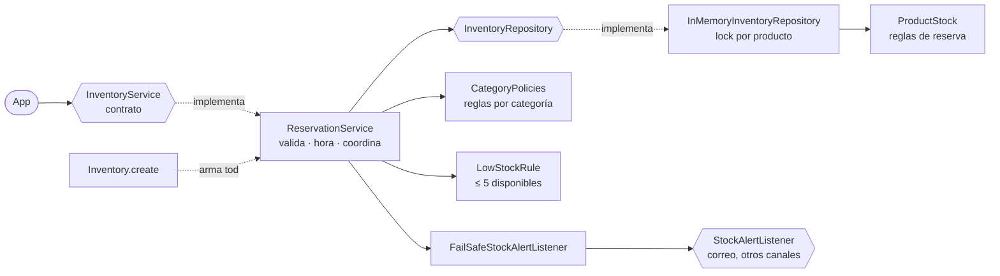
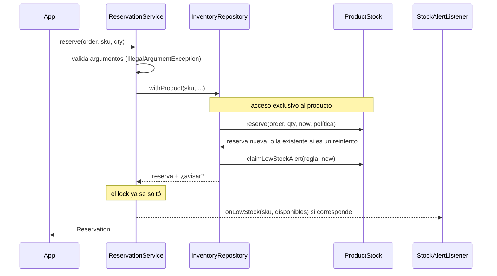
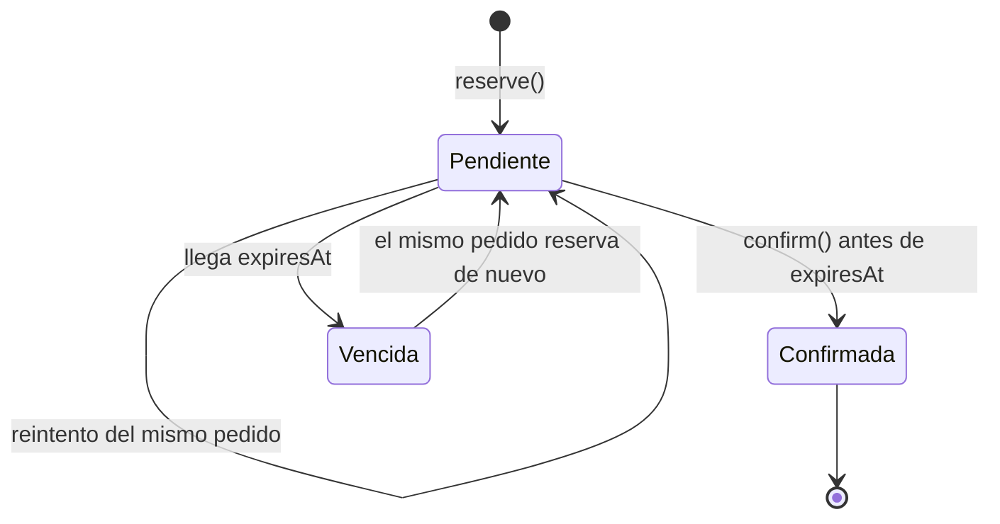

# Decisiones

Implementación del servicio de reservas descrito en el `README.md`. El contrato (`com.store.inventory.api`) y la firma de `Inventory.create` no cambiaron.

```bash
mvn verify   # 51 tests + reporte de cobertura en target/site/jacoco (99% instrucciones, 100% ramas)
```

## 1. Cómo está armado



| Paquete | Qué hay | Cuándo se toca |
|---|---|---|
| `domain` | `ProductStock` (reglas de reserva, vencimiento, confirmación, aviso), `CategoryPolicy`/`CategoryPolicies`, `LowStockRule` | Cambian las reglas del negocio |
| `service` | `ReservationService`: validación de argumentos, reloj, orden de los pasos | Cambia el flujo |
| `persistence` | `InventoryRepository` y su versión en memoria | Migración a base de datos |
| `alert` | `FailSafeStockAlertListener`, `CompositeStockAlertListener` | Nuevos canales de aviso |

### Una reserva de punta a punta



### Estados de una reserva



## 2. Supuestos

El contrato y el README dejan algunos casos abiertos. Así los resolví; cada uno tiene un test.

| Caso | Decisión | Por qué |
|---|---|---|
| La app reenvía un pedido que ya reservó | Devuelve **la misma** `Reservation`, sin apartar unidades ni extender el plazo | El README dice que la app reintenta si la conexión es lenta; sin esto, cada reintento sería una sobreventa |
| Reintento de un pedido ya pagado | Devuelve la reserva confirmada | Un reintento que llega tarde no debe volver a reservar |
| Mismo `orderId` con otra cantidad | `IllegalStateException` | No es un reintento; es un pedido distinto con un id repetido |
| Mismo `orderId` con otro producto | `IllegalStateException` | El contrato dice que cada pedido reserva un solo producto |
| Un pedido cuya reserva venció vuelve a reservar | Se permite, con un plazo nuevo | El cliente reintentó tarde; las unidades ya estaban liberadas |
| Momento exacto en que vence | En `expiresAt` la reserva ya no cuenta | A esa hora el cliente ya no está "a tiempo" |
| `confirm` de una reserva vencida, inexistente o ya confirmada | `IllegalStateException` | Es lo que dice el contrato: "no active reservation" |
| Pedido que supera el límite **y** no tiene stock | `OrderLimitExceededException` | Es un error del pedido, no del inventario; el límite se revisa primero |
| Producto desconocido en `reserve` | `InsufficientStockException` con 0 disponibles | Contrato: "unknown products have none" |
| Registrar un producto que ya existe | Cambia la categoría y conserva stock y reservas | Permite recategorizar sin perder inventario; las reservas hechas conservan su vencimiento |
| `addStock` que desbordaría `int` | `IllegalArgumentException` | Mejor rechazar que dejar un stock negativo |
| Ids en blanco o categoría `null` | `IllegalArgumentException` | El contrato usa esa excepción para argumentos inválidos |

### Avisos de stock bajo

| Caso | Decisión |
|---|---|
| Cuándo se avisa | Cuando una **reserva** deja el producto con 5 disponibles o menos |
| Cuántas veces | Una vez; el siguiente aviso solo después de un `addStock` |
| `addStock` que deja el producto todavía en 5 o menos | No avisa en ese momento. Habilita el aviso y este sale con la siguiente reserva |
| Unidades liberadas porque una reserva venció | No cuenta como reabastecimiento; no vuelve a avisar |
| El canal de aviso falla (correo caído) | Se registra un `WARNING` y la reserva sigue siendo válida. Vender es más importante que avisar |
| Varios pedidos cruzan el umbral a la vez | Sale exactamente un aviso (test de concurrencia) |

El aviso se envía **fuera** del lock del producto: un correo lento no frena a los demás compradores.

## 3. SOLID y patrones, y dónde resuelven un requisito

Solo usé un patrón donde responde a algo que el README dice que va a cambiar.

| Requisito del README | Técnica | Dónde |
|---|---|---|
| "Marketing suele crear una categoría nueva cada temporada" | **Strategy** + **Open/Closed**: las reglas son datos, no `if`s | `CategoryPolicy`, `CategoryPolicies.defaults()` |
| Una categoría nueva sin reglas | Falla al arrancar, no en plena venta | Constructor de `CategoryPolicies` |
| "Se migrará a una base de datos" | **Repository** + **Dependency Inversion** | `InventoryRepository` / `InMemoryInventoryRepository` |
| "Correrá en varias instancias" | La atomicidad está en un solo método del repositorio (`withProduct`) | Ver sección 5 |
| "Quieren expandirse a más canales" | **Composite** (varios canales) + **Decorator** (un canal que falla no rompe nada) | paquete `alert` |
| "Otras personas tendrán que modificarlo sin tu ayuda" | **Single Responsibility**: reglas en `ProductStock`, flujo en `ReservationService`, datos en el repositorio | — |
| Probar vencimientos sin esperar 24 h | El `Clock` se inyecta | `MutableClock` en los tests |
| Un solo lugar que decide las implementaciones | **Factory** / composition root | `Inventory.create` |

**Lo que no usé, a propósito:**
- **Singleton:** el servicio recibe `Clock` y listener por parámetro, y cada test crea el suyo.
- **Spring, Lombok y cualquier framework:** es una librería detrás de un contrato. Sumar un framework complicaría a los tests del equipo sin ganar nada.
- **CQRS:** con una sola consulta (`available`) no aporta.

## 4. Cómo sé que funciona

| Test | Cubre |
|---|---|
| `InventoryServiceTest` | Los tests originales, sin cambios |
| `ReservationLifecycleTest` | Plazo de cada categoría (1 ms antes y justo al vencer), liberación, confirmación, límite de `FLASH_SALE`, validaciones |
| `RetriedOrderTest` | Reintentos del mismo pedido |
| `LowStockAlertTest` | Umbral, sin repetir, reabastecimiento, canal caído |
| `ConcurrentReservationTest` | 300 compradores por 50 unidades: se venden exactamente 50 y sale un solo aviso. 100 reintentos simultáneos del mismo pedido: una sola reserva |
| `CategoryPoliciesTest` | La tabla del README y el fallo cuando falta una categoría |

Verifiqué que el test de concurrencia detecta el problema: sin el lock falla en las 5 repeticiones, y con el lock pasa.

CI: `.github/workflows/ci.yml` corre `mvn verify` en cada push y en cada PR.

## 5. Qué dejé fuera y qué cambiaría antes de producción

**Fuera del alcance:**
- Base de datos real, API HTTP y autenticación. El enunciado pide datos en memoria detrás del contrato.
- Cancelar una reserva de forma explícita. No está en el contrato; hoy la reserva simplemente vence.

**Antes de producción:**

1. **Repositorio en base de datos, que es lo que hace posible varias instancias.** El lock en memoria solo protege una JVM. Con base de datos:
   - `withProduct` sería una transacción con `SELECT ... FOR UPDATE` sobre la fila del producto, o un `UPDATE ... WHERE version = ?` con reintento.
   - Las reservas irían en una tabla con `UNIQUE(order_id)`, que reemplaza a `claimOrder` y hace la idempotencia segura entre instancias.
   - El flag `low_stock_alert_sent` iría en la fila del producto, así el aviso sigue saliendo una sola vez aunque haya varias instancias.
2. **La hora la da la base de datos y no cada instancia.** Con varias instancias, relojes desfasados harían vencer reservas antes o después según qué servidor atienda. La expiración se calcularía con `now()` de la base de datos.
3. **Outbox para los avisos.** Hoy un aviso que falla se pierde, solo queda en el log. Guardar el aviso en la misma transacción que la reserva, y enviarlo con un proceso aparte, garantiza que compras se entere.
4. **Limpieza.** Los pedidos confirmados y vencidos se guardan para siempre, porque se usan para reconocer reintentos. En base de datos se borrarían o archivarían pasado un tiempo mayor que la ventana de reintentos de la app.
5. **Confirmación idempotente.** Si la pasarela de pago también reenvía la aprobación, `confirm` debería aceptar el segundo aviso en vez de lanzar `IllegalStateException`. No lo hice porque el contrato pide la excepción; lo conversaría con el equipo de pagos.
6. **Reglas por configuración.** Hoy una categoría nueva es una línea en `CategoryPolicies.defaults()` más un despliegue. Si Marketing necesita cambiarlas sin desplegar, se leerían de configuración, con la misma validación al arrancar.
7. **Observabilidad.** Métricas de reservas creadas, vencidas y confirmadas, rechazos por falta de stock, y avisos entregados o fallidos.
